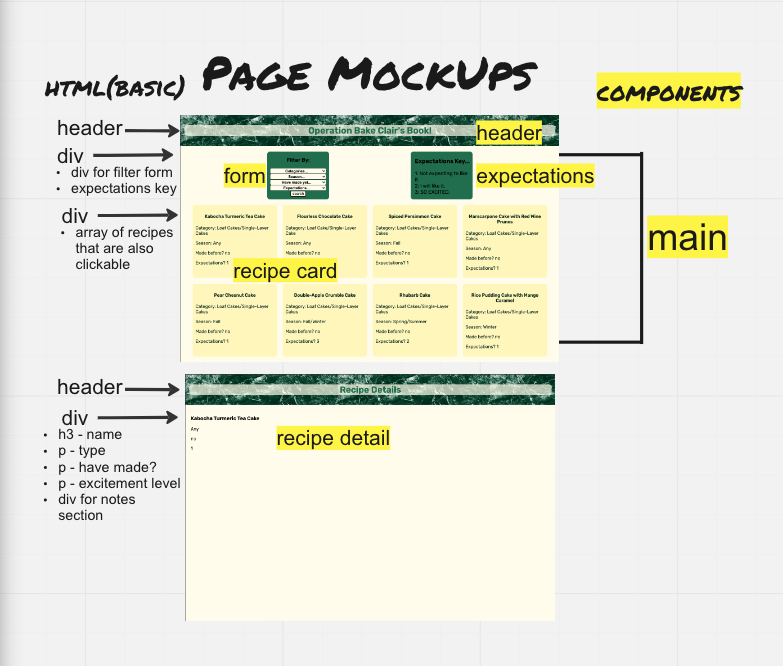

## Today's Todos...
- make a simple miro board ✅
- decide on if we are doing a SPA (yes) ✅
- find some reference code ✅
- start creating component folders & files
- write some pseudo code 

## CSS notes to visit when convenient
- need to center title in header